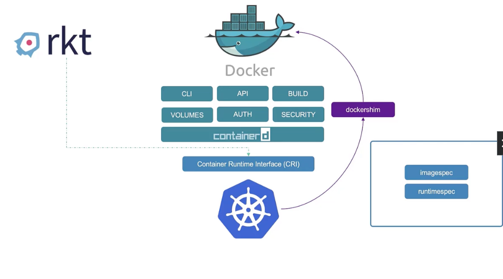
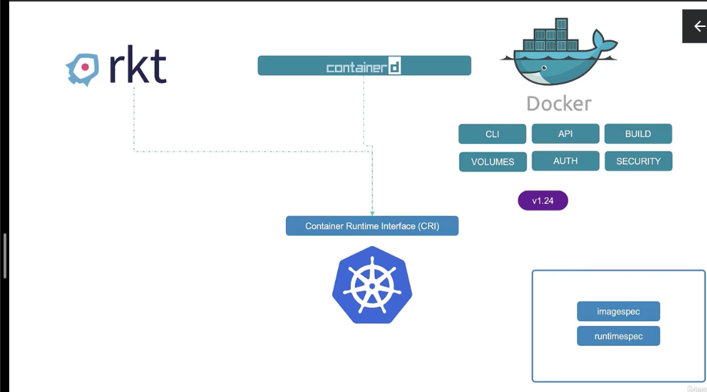

# Der Unterschied zwischen Docker und ContainerD

## Kubernetes wird veröffentlicht

Anfang 2014 als Kubernetes veröffentlicht wurde war es dafür ausgelegt nur mit Docker zu funktionieren.

Mit dem Aufkommen von Alternativen zu Docker, wie rkt oder CRI musste sich Kubernetes überlegen,
wie es alternativen unterstützen konnte. Das wurde durch die `cri` erreicht. Das ```Container Runtime Interface``` erlaubte es jeder Contaiener runtime mit Kubernetes zu funktionieren, solange es den Open Container Initiative `oci` Standards entsprach.

Das Problem für Docker war, das es vor den `oci` Standards entwickelt wurde und daher diesen nicht entsprach.

Kubernetes entwickelte deswegen `dockershim` ein alternatives Interface um direkt Docker zu unterstützen.



Docker besteht aus deutlich mehr Komponenten als der Runtime, unter anderem `runC` der Docker eigenen Container Runtime welche durch `containerD` gesteuert
wird. Nun ist Docker als ganzes nicht mit der `cri` kompatibel, aber
`ContainerD` ist es. Und da die Container von Docker dem OCI Standard
entsprechen, konnte ContainerD als Runtime mit Kubernetes verwendet werden.

Da `dockershim` schwer zu unterstützen war, entschied man sich in Version 1.24.
dazu es zu entfernen und nur noch runtime's die kompatible mit cri sind zu erlauben


