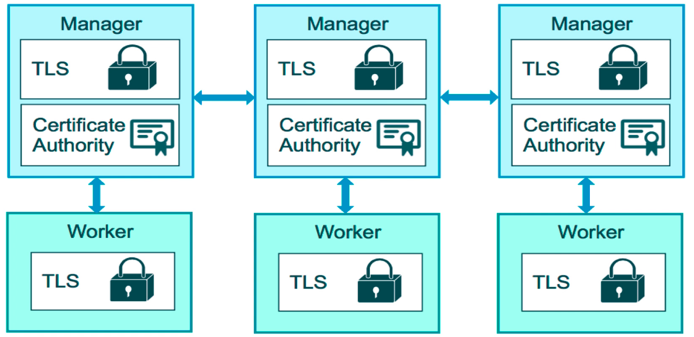
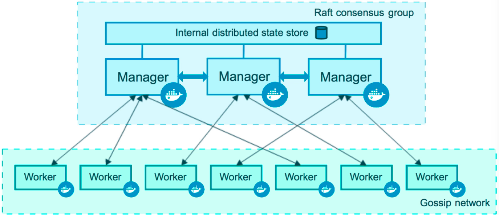
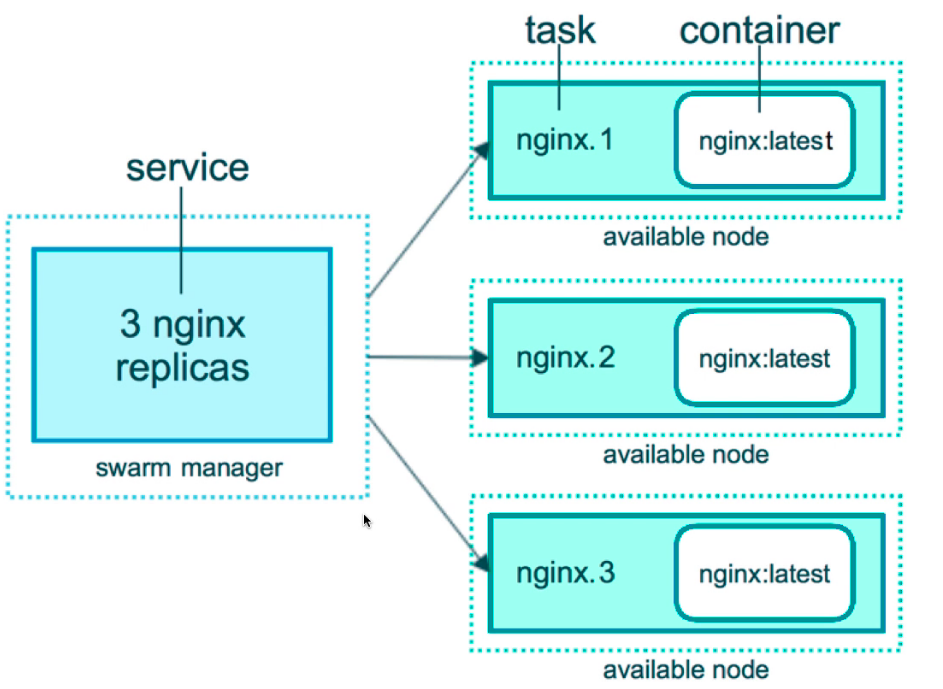

# Einleitung

Der Aufbau der Docker Kommandozeile ist sehr stukturiert.

`docker command subcommand options`

## Basic Docker Commands

```bash
docker container stop
docker image ls                              # zeigt mir alle heruntergeladenen Images
docker container ls -a
docker container rm
docker container log name
docker container exec -it database /bin/bash # gut zum debuggen im Container
```

Shell in einem Container öffnen

```bash
docker container run   - it <container> bash # to get a shell in a new Container
docker container exec  - it <container>      # Verbindung zum bestehenden Container aufnehmen
docker container start - ai <container>      # Einen bereits verwendeten Container wieder starten und verbinden
```

Was passiert wenn wir einen Container starten?:

```bash
# Docker container run --publish 80:80 image

1. Prüft intern im image Cache ob das Image schon vorliegt
2. Nächster Schritt im Docker Hub danach suchen
3. Lädt die angebene Version herunter(Default latest)
4. Stellt einen neuen Container basieren auf dem Image bereit
5. Gibt dem Container im privaten Netwerk der Container Engine eine IP
6. Öffnet Port 80 auf dem Host und leitet den Traffic auf den Port 80 im Container 
7. Startet Container indem es den Command im Image nutzt
```

## Container untersuchen

Kommandos zum Untersuchen von Container

```bash
docker container top     - process list in one container
docker container inspect - details of one container config; zeigt Metainformation
docker container stats   - performance details of a container
```

## Was ist ein Container/Image

Ein Image sind die App Binaries und Abhängigkeiten
Metainformation über das Image und wie es zu nutzen ist
--> Es ist kein Betriebssystem. Es fehlt der Kernel, die Module etc. Diese dinge kommen vom Host

* Ein Image ist eine Applikation welche wir starten möchten.
* Ein Container ist eine Instanz dieses Image welches einen Prozess startet
* Man kann beliebig viele Container eines Images starten
* Images werden in Registries gesichert, der Standard für Docker ist Docker HUB

## Layers

Images bestehen aus Änderungen am Filesystem und den Metadaten.
Jeder Layer hat eine Eindeuting Sha-Signatur. Auf einem Pc wird jeder Layer nur einmal gesichert. So werden Dopplungen bei Images welche sich nur in ihrem Appdaten unterscheiden aber auf dem gleichen Image basieren nur 1x geladen

## Prüfung der Engine

```bash
docker version
# Prüft ob die CLI mit der Engine kommuinizieren kann
docker info
# zeigt die Einstellungen der Engine
```

## Docker Hub

DockerHub ist ei Repository für Docker Images. Ist ziemlich einfach zu nutzen. Repos müssen existieren bevor der Upload stattfindet.
Image ist immer via Nutzer/Image zu erreichen. Tags sind einfach nur Pointer welche auf eine Version zeigen.

Wenn ich einen Tag setzen will, und mein Image veröffentlichen möchte:

```bash
docker image tag nginx phpe/nginx  <-- ich hatte noch ein nginx Image was ich als Basis verwendet habe.

docker image push phpe/nginx --> lädt mein Image hoch
docker login                 --> falls der Nutzer nicht hinterlegt ist
docker logout                --> falls es eine geteileter Server ist
```

## Dockerfile

Ein Dockerfile ist ein Textfile mit Anweisungen wie das Image durch die Dockerengine gebaut werden soll, welche Images als Basis dient etc. Bretfischer repo auf Dockerhub hat eine gut erklärtes Dockerfile, es ist auch in der Nextcloud hinterlegt.
Es gibt einige Do's and dont's bei Dockerfiles [best-practises][best-practises]
docker image bauen:

docker image build -f docker-file -t customnginx .

## Docker Swarm

Swarm ist eine Cluster Lösung welche 2016 veröffentlicht wurde und in der Docker Engine bereits enthalten ist.

### Swarm Architektur

Ähnlich wie andere Container Orchestrierer gitb es bei Swarm 2 verschieden Aufgaben. Das ist zum einen der Manager und zum anderen der Worker. Die spezifischen Aufgaben sind anhand der Namen zu erkennen.



Der oder die Manager teilen sich eine Datenbank (die Raft Datenbank) und kommunizieren mit den Workern. Die gesamte Kommunikation findet verschlüsselt statt. Sobald ein Cluster aufgesetzt wird legt dieser ein Root Certifikat an, welches für die Verschlüsselung verwendet wird.


### Swarm Services

Bevor der erste Swarm Service aktiviert werden kann muss zuerst der Swarm initialisiert werden, dazu einfach ein:
`docker swarm init`

Im Anschluss stehen allen Swarm Features zur Verfügung.

#### Swarm Service erstellen



Ein Service besteht aus mehreren Tasks welche abgearbeitet werden. Diese Tasks werden in Container abgearbeitet welche auf den verfügbaren Nodes ausgeführt werden. Mittels des Replica-Sets gibt man an wie breit ein Service verfügbar sein soll.

Docker Service erstellen der den Google DNS pinged

`docker service create alpine ping 8.8.8.8`

Alle Service anzeigen:

```bash
root@Desktop-PC:~# docker service ls
ID                  NAME                   MODE                REPLICAS            IMAGE               PORTS
wvaxhgetfunn        musing_proskuriakova   replicated          1/1                 alpine:latest       
```

Details zu einem speziellem Service ansehen (den Namen habe ich aus dem vorherigen Befehl bezogen):

```bash
root@Desktop-PC:~# docker service ps musing_proskuriakova
ID                  NAME                     IMAGE               NODE                DESIRED STATE       CURRENT STATE           ERROR               PORTS
ad9a4exeqlpd        musing_proskuriakova.1   alpine:latest       Desktop-PC          Running             Running 2 minutes ago
```

#### Einen Service aktualisieren um sein Replikaset zu erweitern

```bash
docker service update quirky_shtern --replicas 3
```

Docker Swarm Ports:
<!-- [Docker Swarm Ports][docker-swarm-ports] -->
<!-- was wollte ich hier zeigen -->

#### Funktionsweise der Replikasets testen

Man kann mittels `docker container rm -f` einen dieser Container stoppen und dann mittels `docker service ps` beobachten wie er durch swarm einfach wieder neu erschaffen wird
Um das im Detail zu beobachten kan man mittels `watch -d docker service ps` sehr gut sehen wie das Replikaset wieder auf den Soll-Zusatnd aufgefüllt wird.

Um sich die Container auf anderen Nodes anzusehen:

`docker node ps node2`

##### Einen Service wieder stoppen

Dadurch das die Container auf irgendwo laufen können und die Container immer wieder neu gestartet werden, muss en Service immer explizit entfernt werden, dies macht man auch über den Service Command: `docker service rm service-name`.

##### 3-Tier-Service

Um die folgenden Schritte nachvollziehen zu können habe ich [play-with-docker][play-with-docker] verwendet. Man kann aber auch [docker-machine][docker-machine] verwenden(auf Windows und Mac mit dem Docker-Toolset bereits installiert), und auf diesen docker installieren. am besten mittels [get-docker][get.docker.com]

##### Server für den Swarm vorbereiten

Um einen Swarm zu erstellen muss zuerst ein Manager erstellt werden, beim erstellen muss die IP des Servers verwendet mit der ihn die anderen erreichen:
`docker swarm init --advertise-addr 192.168.0.8`
Der dann ausgegeben Befehl aknn verwendet werden um die weiteren Nodes in den Swarm aufzunehmen.

`docker swarm join --token SW...384o 192.168.0.8:2377`

Mann kann sich die token auch jederzeit wieder anzeigen lassen:

`docker swarm join-token manager|worker`

Sofern die Aufnahme des Servers erfolgreich war kann man das auf einem Manager Node prüfen (nur auf einem Manager)
`docker node ls`

 auf einem Manager sich die Server anzeigen lassen. Der Stern hinter dem Namen zeigt auf welcher Maschine man aktuell ist.
Es ist auch möglich einen Worker zu einem Manger zu heben und andersrum:
`docker node update --role manager node2`

## Network

### Overlay Network

Overlay Netzwerke können wie normale Netzwerke mittels `docker network create` angelegt werden. Es muss nur beachtet werden das die Option `--driver overlay` angegeben wird.
Mit ihrer Hilfe kann man die Netze für einzelne Anwendungen/Kundensysteme trennen. Man muss lediglich beim Anlegen des Service bzw. dem Services Zugriff auf das Netzwerk geben.
[docker-certification][docker-certification]

[docker-devops-prep-guide][devops-prep-guide]

Check out the [Jekyll docs][jekyll-docs] for more info on how to get the most out of Jekyll. File all bugs/feature requests at [Jekyll’s GitHub repo][jekyll-gh]. If you have questions, you can ask them on [Jekyll Talk][jekyll-talk].

[jekyll-docs]: https://jekyllrb.com/docs/home
[jekyll-gh]:   https://github.com/jekyll/jekyll
[jekyll-talk]: https://talk.jekyllrb.com/
[best-practises]: https://docs.docker.com/develop/develop-images/dockerfile_best-practices/
[play-with-docker]: play-with-docker.Commands
[docker-machine]: https://docs.docker.com/machine/
[get.docker.com]: https://get.docker.com/
[docker-swarm-ports]:https://www.bretfisher.com/docker-swarm-firewall-ports/
[devops-prep-guide]: https://github.com/DevOps-Academy-Org/dca-prep-guide
[docker-certification]:https://www.bretfisher.com/docker-certified-associate/
